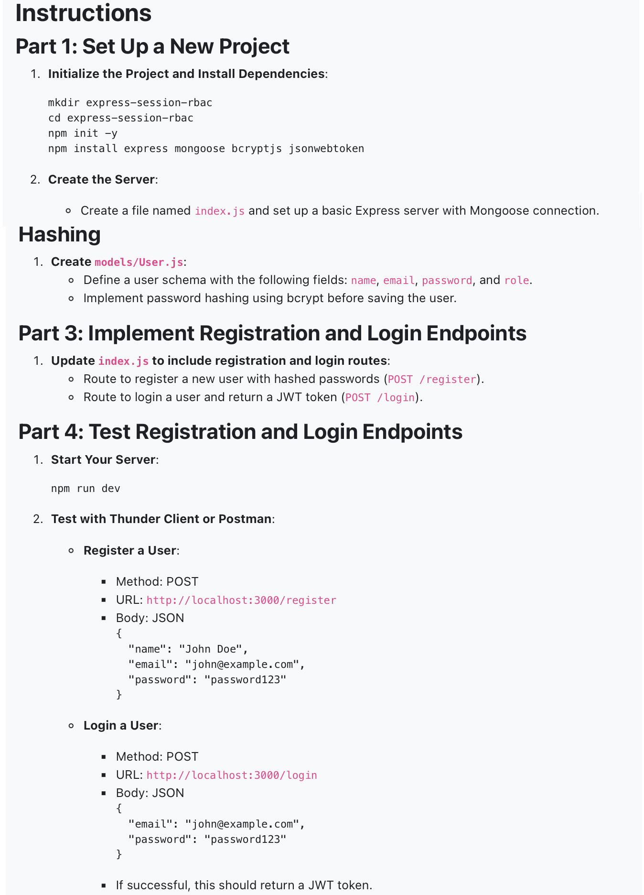
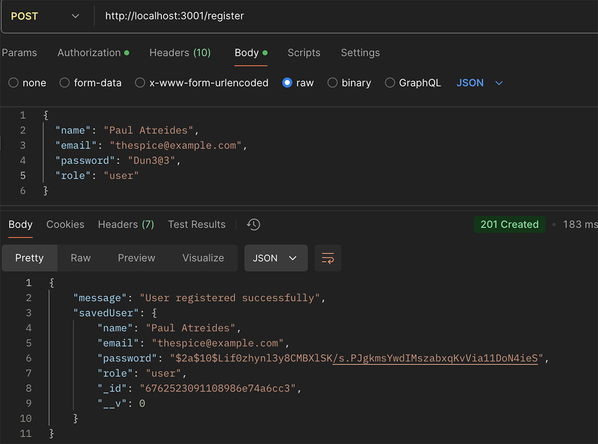
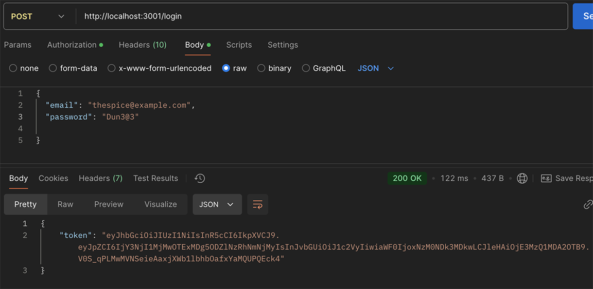
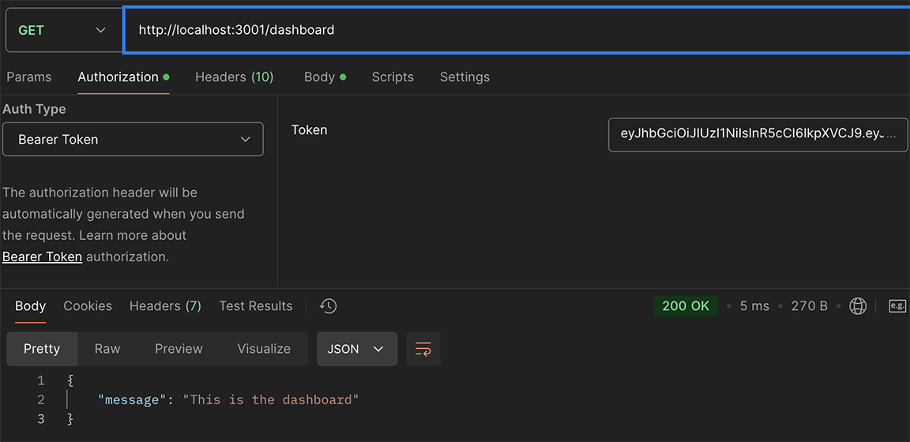
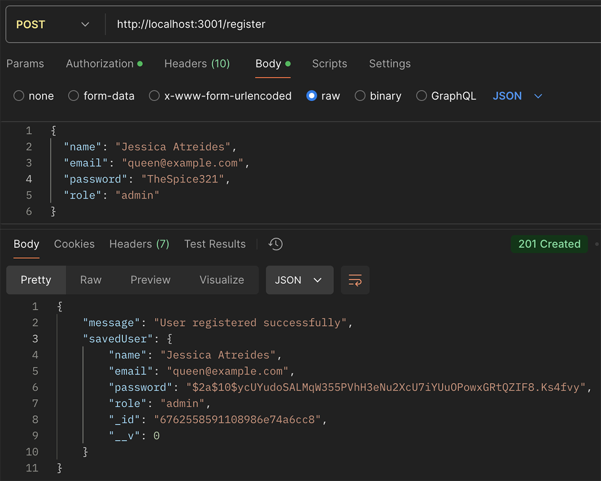
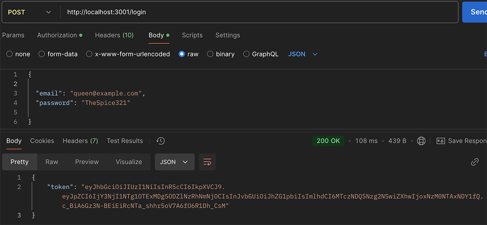
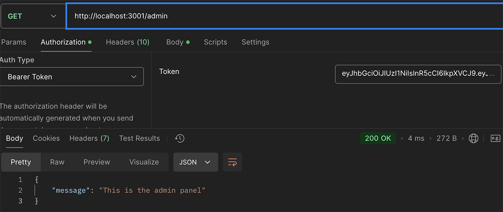
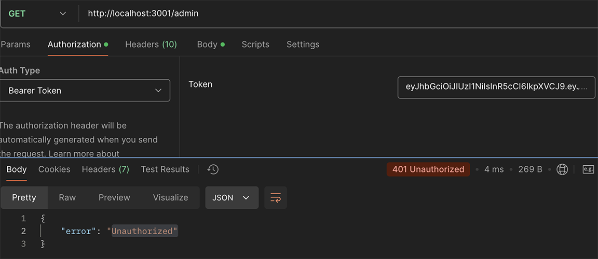

## **Express-Session-RBAC**

## **Objective**
- Set up a new Express project.
- Implement middleware to protect routes.
- Understand role-based access control and its importance.
- Implement registration and login functionality with role-based access control (RBAC).

- Take Screenshots:

- [x] Screenshot of the POST request to register a user.
- [x] Screenshot of the POST request to login a user with the returned JWT token.

## **Part 5: Implement Middleware for Route Protection**
- [x] Create Middleware for Authentication: middleware/authorization.js

## **Part 6: Protect Routes with Authentication Middleware**
- [x] Update index.js to include protected routes: (GET /dashboard)
- [x] Test with Postman

## **Implement Role-Based Access Control (RBAC)**
-  Test Role-Based Access Control
- Test with Thunder Client or Postman
- [x] Register an Admin User: Method: POST

- [x] Login as Admin User: Method: POST

- [x] Access Admin Route as Admin: Method: GET: URL: http://localhost:3001/admin

- [x] Access Admin Route as Regular User: Method: GET: URL: http://localhost:3001/admin

